<div align="center">
  
  # KoneKA 
  ### Menuju kota inklusif, aman dan tangguh

  
  [](https://koneka.netlify.app)
  [](https://github.com/segoiwakpeyek/KoneKa-)
  [](LICENSE)
  
  **Submission for ITECHNO CUP 2026 - Web Development**
  
  **By SEGOIWAKPEYEK**
  
</div>

---

## 📋 Daftar Isi

- [Tentang Proyek](#-tentang-proyek)
- [Fitur Unggulan](#-fitur-unggulan)
- [Demo & Screenshot](#-demo--screenshot)
- [Kompatibilitas Mobile & Instalasi PWA](#-kompatibilitas-mobile--instalasi-pwa-web-to-app-experience)
- [Teknologi](#-teknologi)
- [Arsitektur Sistem](#-arsitektur-sistem)
- [Folder Structure](#-folder-structure)
- [Sistem Keamanan & Proteksi Siber](#-sistem-keamanan--proteksi-siber)
- [Instalasi & Setup](#-instalasi--setup)
- [Penggunaan](#-penggunaan)
- [Penjelasan Kredensial Admin Tester](#-penjelasan-kredensial-admin-tester)
- [API Documentation](#-api-documentation)
- [Testing & Verifikasi Otomatis](#-testing)
- [Tim Developer](#-tim-developer)
- [Lisensi](#-lisensi)

---

## 👥 Tim Developer

| Nama | Peran | GitHub |
|------|-------|--------|
| **Muhammad Prayoga Sejati** | Project Lead & Full Stack Backend Developer | [GitHub](https://github.com/[username1]) |
| **Keysha Aqilah** | Full Stack Frontend Developer | [GitHub](https://github.com/[username2]) |
| **Karina Syifa Nuur Callysta** | Deployment testing | [GitHub](https://github.com/[username3]) |

---

## 🎯 Tentang Proyek

### Latar Belakang

Agenda 2030 untuk Pembangunan Berkelanjutan (*Sustainable Development Goals* / SDGs) menjadi komitmen dan kerangka kerja global terpadu yang diadopsi oleh Indonesia melalui Peraturan Presiden Nomor 59 Tahun 2017 dan diperkuat oleh Peraturan Presiden Nomor 111 Tahun 2022. Komitmen ini menuntut integrasi harmonis antara pertumbuhan ekonomi inklusif, pemanfaatan inovasi teknologi andal, serta ketahanan kota dan komunitas masyarakat di seluruh daerah.

Namun, di era transformasi digital saat ini, realisasi di tingkat akar rumput (*grassroots*) masih menghadapi tiga tantangan mendasar yang saling terkait:
1. **Kesenjangan Partisipasi Publik & Lambatnya Penanganan Isu Lingkungan**:  
   Sebagian besar platform pelaporan warga (*citizen reporting*) yang ada saat ini masih menempatkan masyarakat sekadar sebagai "pelapor pasif". Penyelesaian masalah sepenuhnya digantungkan pada birokrasi pemerintah yang kerap terbentur keterbatasan anggaran, personel, dan birokrasi berbelit. Akibatnya, isu lingkungan berskala mikro—seperti tumpukan sampah liar, fasilitas umum terbengkalai, atau kerusakan jalan—berlarut-larut tanpa penanganan segera, padahal banyak di antaranya dapat diselesaikan lebih cepat melalui swadaya dan gotong royong antarwarga.
2. **Keterbatasan Visibilitas & Digitalisasi Operasional Pelaku UMKM Lokal**:  
   Usaha Mikro, Kecil, dan Menengah (UMKM) menyumbang lebih dari 61% terhadap PDB nasional dan menyerap 97% tenaga kerja di Indonesia. Kendati demikian, jutaan pelaku usaha mikro di tingkat rukun tetangga dan kelurahan belum memiliki akses terhadap perangkat pembukuan digital yang praktis, sistem pemantauan stok, penerbitan invoice resmi, maupun visibilitas geospasial yang menghubungkan mereka secara langsung dengan calon pelanggan di lingkungan terdekatnya.
3. **Kebutuhan Inovasi Web yang Adaptif, Cepat, dan Inklusif**:  
   Masyarakat membutuhkan sarana digital cerdas yang tidak membebani kuota perangkat, tidak menuntut instalasi aplikasi berat dari app store, serta aman dari ancaman siber dan manipulasi data.

Selaras dengan tema kompetisi ITechno Cup 2026: **"Adaptive Innovation for a Future-Ready Digital Society"** serta subtema **"Smart Sustainable Digital Solution for Inclusive Society"**, platform **KoneKA** hadir sebagai solusi terintegrasi yang menjembatani partisipasi sosial warga dan pemberdayaan ekonomi lokal secara simultan.

### Solusi yang Ditawarkan

KoneKA menghadirkan pendekatan **Platform Dwipilar (*Dual-Engine Platform*)** berbasis peta geospasial interaktif (*Leaflet.js & Marker Cluster*) dalam satu ekosistem akun terpadu:

1. **Pilar Sosial & Infrastruktur (*Peer-to-Peer Civic Resolution*)**:  
   Menggeser paradigma pelaporan konvensional menjadi kolaborasi aktif. Warga tidak hanya melaporkan masalah infrastruktur fisik, kebersihan lingkungan, atau fasilitas publik, tetapi warga lain dapat langsung mendaftarkan komitmen bantuan sebagai relawan (*helper*). Kualitas dan transparansi penyelesaian dijamin melalui **Mekanisme Konsensus Kuorum Warga (3 Suara Validasi Kolektif)** sebelum status dinyatakan tuntas (*Selesai*).
2. **Pilar Ekonomi & UMKM (*Hyperlocal Micro-ERP*)**:  
   Memberdayakan pelaku usaha mikro melalui direktori peta publik (marker biru) yang meningkatkan perputaran ekonomi sirkular lokal (*local circular economy*). Di balik itu, pemilik usaha dibekali *dashboard* bisnis mandiri: pencatatan arus kas (grafik dinamis SVG), manajemen inventaris stok produk dengan indikator kritis otomatis, generator invoice terstruktur, hingga pencetakan struk digital (*thermal print & WhatsApp shareable*).

### Keselarasan dengan 3 Pilar SDGs (Sustainable Development Goals)

KoneKA dirancang secara holistik dan secara langsung mendukung implementasi **3 Pilar SDGs** yang ditentukan dalam subtema ITechno Cup 2026:

| Pilar SDG | Target Relevan | Implementasi Konkret pada Fitur & Arsitektur KoneKA |
| :--- | :--- | :--- |
| **SDG 8: Pekerjaan Layak dan Pertumbuhan Ekonomi** | **Target 8.3**: Mendorong formalisasi, produktivitas, dan pertumbuhan usaha mikro, kecil, dan menengah (UMKM) melalui akses terhadap teknologi digital dan layanan keuangan. | • **Direktori Geospasial UMKM**: Memetakan toko fisik/warung warga di tingkat kecamatan sehingga mudah dijangkau tetangga sekitar.<br/>• **Mini-ERP Terintegrasi**: Modul pembukuan arus kas masuk/keluar, visualisasi grafik performa finansial harian/bulanan/tahunan, kontrol stok inventaris otomatis, dan invoice otomatis.<br/>• **Dukungan Pembayaran Modern**: Fasilitas pengaturan transaksi non-tunai (QRIS, E-Wallet, Transfer Bank) di samping tunai/COD. |
| **SDG 9: Industri, Inovasi, dan Infrastruktur** | **Target 9.1**: Mengembangkan infrastruktur berkualitas, andal, dan tangguh.<br/>**Target 9.c**: Meningkatkan akses terhadap teknologi informasi dan komunikasi mutakhir. | • **Digitalisasi Monitoring Infrastruktur Publik**: Kategori pelaporan khusus `infra` untuk mendata jalan berlubang, jembatan rusak, drainase tersumbat, dan lampu penerangan jalan dengan penandaan GPS presisi.<br/>• **Inovasi Web Cerdas (*Smart Web Architecture*)**: Progressive Web App (PWA) dengan *offline caching shell* (`sw.js`), kompresi gambar berbasis *HTML5 Canvas* di sisi klien, dan *WebRTC Live Camera Engine* langsung dari peramban.<br/>• **Ketahanan Siber (*Cybersecurity Protection*)**: Proteksi gerbang bot mutakhir berbasis **Cloudflare Turnstile** dan Content Security Policy (CSP) ketat. |
| **SDG 11: Kota dan Komunitas Berkelanjutan** | **Target 11.3**: Meningkatkan urbanisasi inklusif dan partisipasi warga dalam pengelolaan permukiman.<br/>**Target 11.6**: Mengurangi dampak lingkungan perkotaan yang merugikan, termasuk pengelolaan sampah. | • **Gotong Royong Partisipatif**: Mentransformasikan keluhan pasif menjadi gerakan swadaya aksi relawan (*"Saya Mau Bantu"*).<br/>• **Penanganan Isu Lingkungan**: Kategori pelaporan `sampah` (tumpukan sampah liar/TPS darurat) dan `fasum` (fasilitas umum rusak).<br/>• **Konsensus Kolektif & Swakelola Komunitas**: Kuorum 3 suara validasi warga untuk verifikasi lapangan serta *community flagging* otomatis (≥3 laporan spam atau ≥5 usaha fiktif) untuk menjaga integritas data.<br/>• **Gamifikasi Civic Pride**: *Leaderboard* warga teraktif per kecamatan untuk menumbuhkan budaya peduli lingkungan. |

### Tujuan Proyek

- 🎯 **Tujuan Utama**: Membangun ekosistem web terpadu yang memfasilitasi warga untuk bergotong-royong menyelesaikan masalah perkotaan secara transparan sekaligus mendigitalkan operasional UMKM lokal, sebagai kontribusi nyata terhadap pencapaian **SDG 8, SDG 9, dan SDG 11** di tingkat komunitas.
- 📊 **Target Pengguna**: Masyarakat umum yang peduli terhadap kelestarian lingkungan dan infrastruktur sekitarnya, serta pelaku usaha mikro/UMKM yang membutuhkan sarana promosi dan pencatatan finansial digital tanpa biaya lisensi.
- 💡 **Value Proposition**: Model *peer-to-peer civic resolution* berbasis konsensus kuorum warga yang dipadukan dengan modul *Hyperlocal Micro-ERP* dalam satu akun terintegrasi, dirancang dalam arsitektur PWA yang ringan, aman, dan dapat dipasang di ponsel tanpa perantara toko aplikasi.

---

## ✨ Fitur Unggulan

### Fitur Utama

| Fitur | Deskripsi | Keunggulan |
|----------|--------------|---------------|
| **Peta Interaktif & Pelaporan Masalah** | Warga dapat melaporkan masalah perkotaan (infrastruktur, kebersihan, fasilitas umum) lengkap dengan foto, deskripsi, dan titik lokasi pada peta interaktif | Lokasi masalah tervisualisasi secara real-time di peta dengan marker berwarna sesuai status (merah = laporan masalah, kuning = Validasi, hijau = Selesai), memudahkan identifikasi cakupan dan prioritas |
| **Peer-to-Peer Civic Resolution** | Warga lain bisa langsung bantu dengan mengerjakan masalah yang dilaporkan, lalu mengunggah bukti penyelesaian beserta deskripsi progres | Model unik yang menggeser peran pemerintah dari penyelesai tunggal menjadi fasilitator solusi datang langsung dari komunitas |
| **Validasi Kolektif** | Setelah bukti selesai diunggah warga sekitar memvalidasi hasilnya, dibutuhkan minimal 3 suara "Valid" agar status berubah menjadi Selesai, atau 3 suara "Tidak Valid" agar dikembalikan ke status Baru | Mekanisme crowdsourced verification menjamin transparansi dan akuntabilitas penyelesaian masalah |
| **Direktori UMKM Lokal** | Warga dapat mendaftarkan usahanya berdasarkan kategori tertentu, lengkap dengan foto, lokasi di peta, jam operasional, dan metode pembayaran | Satu akun terintegrasi untuk warga dan UMKM untuk meningkatkan visibilitas pelaku usaha mikro di komunitas sekitar |

### Fitur Tambahan

- **Komentar** — Setiap laporan masalah dan halaman UMKM memiliki fitur komentar untuk diskusi warga, termasuk quick-chip (" Saya juga lihat", "Hati-hati")
- **Kamera & Upload Foto** — Mendukung pengambilan foto langsung dari kamera perangkat atau galeri untuk laporan masalah, bukti penyelesaian, foto usaha, dan foto profil
- **Leaderboard Kontribusi** — menampilkan username warga yang berkontribusi di tingkat kecamatan dan mendorong semangat gotong royong
- **Dashboard Usaha** — Manajemen stok produk, pencatatan transaksi/cashflow, dan pembuatan invoice otomatis
- **Jam Operasional** — Pengaturan jam buka-tutup per hari (Senin–Minggu), tombol "Samakan semua hari ke jam Senin", dan fitur "Tutup Sementara" dengan rentang tanggal libur
- **Sistem Flagging Komunitas** — Laporan atau usaha yang ditandai oleh ≥3 (laporan) atau ≥5 (usaha) warga akan otomatis dihapus, menjaga kualitas konten
- **Verifikasi Email OTP** — Registrasi akun melalui kode OTP 5-karakter yang dikirim via email (EmailJS + Resend API) dengan validasi Cloudflare Turnstile
- **Progressive Web App (PWA)** — Dapat diinstall di perangkat mobile layaknya aplikasi native dengan Service Worker untuk caching offline
- **Ganti Wilayah** — Autocomplete kota dan kecamatan se-Indonesia dengan ghost text suggestion, disertai cooldown 30 hari untuk perubahan lokasi akun

---

## 📸 Demo & Screenshot

### Live Demo

🔗 **[Kunjungi Website](https://koneka.netlify.app)**

### Screenshot Aplikasi

<div align="center">
  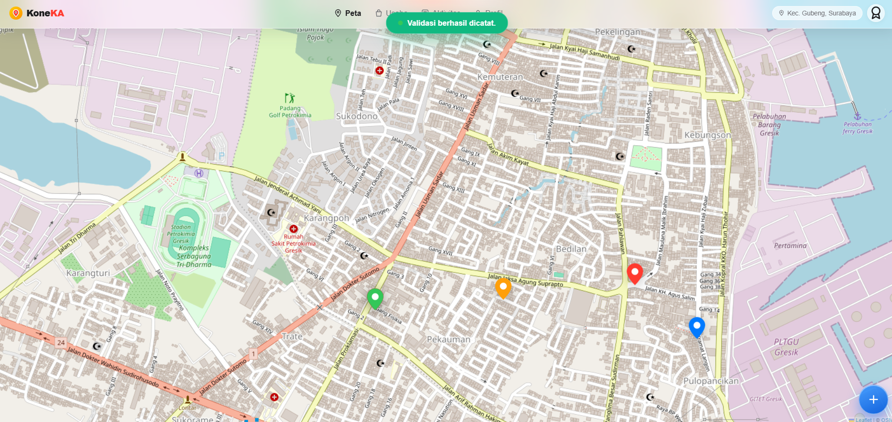
  <p><b>Gambar 1. Peta Interaktif Wilayah &amp; Marker Real-Time</b><br/><em>Visualisasi sebaran masalah perkotaan (merah = baru, kuning = validasi warga, hijau = selesai) dan persebaran titik UMKM lokal (biru) berbasis Leaflet.js</em></p>
  <br/>

  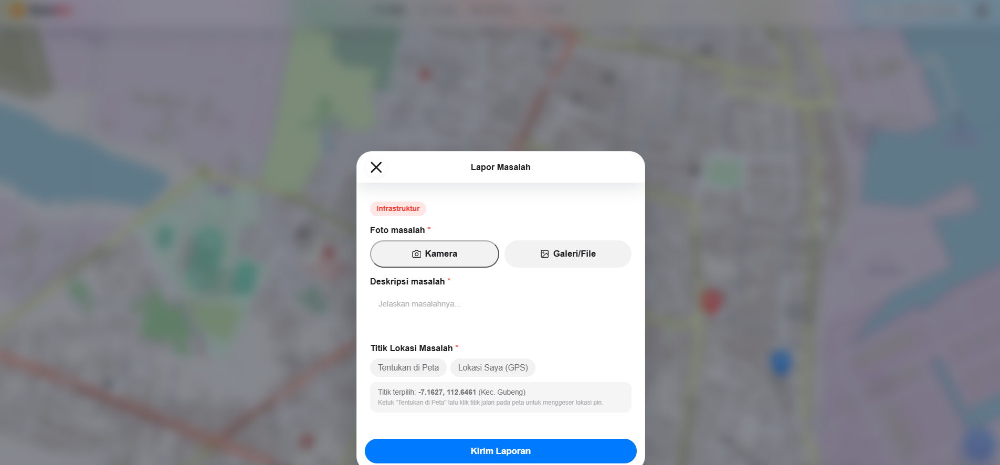
  <p><b>Gambar 2. Formulir Lapor Masalah Berbasis Bukti Nyata</b><br/><em>Warga dapat mengambil foto bukti langsung via kamera gawai/galeri, mengisi deskripsi masalah, dan menyematkan koordinat lokasi akurat pada peta</em></p>
  <br/>

  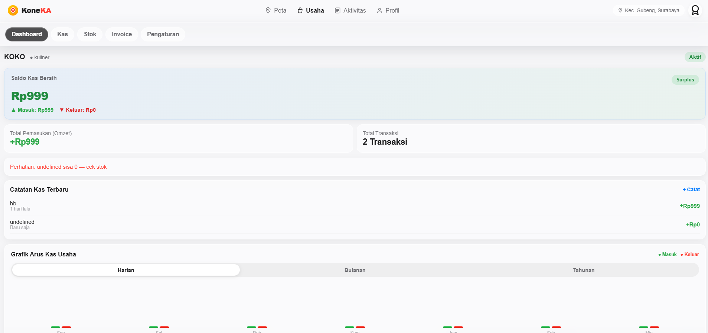
  <p><b>Gambar 3. Dashboard Usaha &amp; Manajemen Finansial UMKM</b><br/><em>Pengelolaan kas bersih, total omzet, riwayat transaksi kas masuk/keluar, grafik arus kas harian/bulanan/tahunan, serta manajemen stok dan invoice</em></p>
  <br/>

  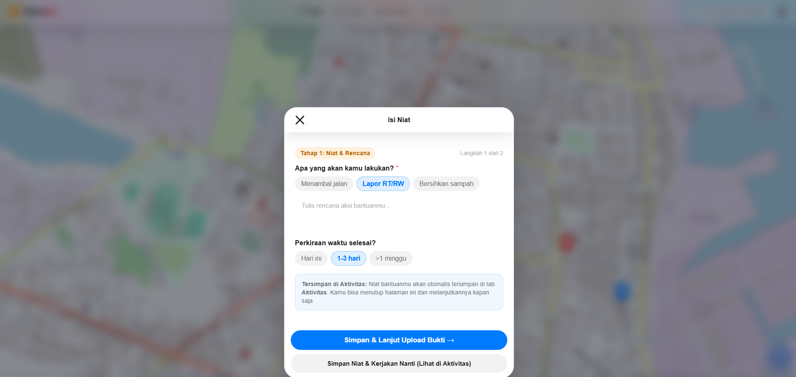
  <p><b>Gambar 4. Gotong Royong Peer-to-Peer Resolution (Tahap 1: Niat &amp; Rencana)</b><br/><em>Warga dapat menyatakan komitmen untuk turun tangan membantu menyelesaikan masalah dengan memilih jenis rencana aksi dan estimasi durasi pengerjaan</em></p>
  <br/>

  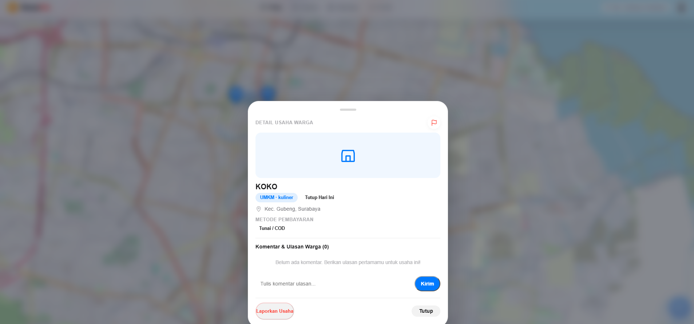
  <p><b>Gambar 5. Detail Profil UMKM &amp; Ulasan Komunitas</b><br/><em>Informasi lengkap pelaku usaha mikro lokal mencakup jam operasional hari ini, pilihan metode pembayaran (Tunai/QRIS/Transfer), kolom komentar/ulasan warga, serta pelaporan pelanggaran</em></p>
</div>

### Video Demo

📹 **[Link Video Demo](https://[URL_VIDEO])** _(opsional)_

---

## 📱 Kompatibilitas Mobile & Instalasi PWA (Web-to-App Experience)

KoneKA dikembangkan dengan filosofi **Mobile-First & Universal Compatibility**. Meskipun dibangun sebagai aplikasi web (Single Page Application), antarmuka KoneKA dioptimasi penuh untuk perangkat *smartphone* (Android & iOS) dan dapat **diunduh serta dipasang langsung menjadi aplikasi ponsel** layaknya aplikasi *native* tanpa perlu melalui Google Play Store atau Apple App Store.

### 🌟 Keunggulan Kompatibilitas Mobile

1. **Antarmuka Mobile-First yang Ergonomis**:
   - Dilengkapi **Bilah Navigasi Bawah (*Bottom Navigation Bar*)** (`Peta`, `Usaha`, `Aktivitas`, `Profil`) yang dirancang khusus untuk kenyamanan jangkauan satu jempol (*single-thumb zone*).
   - Seluruh formulir (Lapor Masalah, Bukti Bantuan, Detail Usaha) hadir dalam bentuk **Bottom Sheet Modal** yang meluncur mulus dari bagian bawah layar ponsel.
   - Peta Leaflet.js telah dioptimasi untuk interaksi layar sentuh (*touch gestures*): *pinch-to-zoom*, *drag & pan*, *double-tap zoom*, serta pengelompokan penanda otomatis (*marker clustering*).

2. **Akses Perangkat Keras Ponsel (*Native Device Capabilities*)**:
   - **GPS Geolocation Presisi**: Memanfaatkan sensor GPS ponsel (`navigator.geolocation`) untuk memindai titik koordinat warga secara akurat saat melaporkan masalah atau menandai lokasi usaha.
   - **Kamera Ponsel Langsung**: Mengintegrasikan kamera bawaan ponsel (kamera belakang/depan) via `HTML5 MediaDevices API` untuk mengambil foto bukti secara *real-time* di tempat kejadian.

3. **Kemampuan PWA (Progressive Web App) — Unduh Menjadi Aplikasi Mandiri**:
   - **Tanpa Perlu Toko Aplikasi (No App Store Required)**: Warga tidak perlu menghabiskan kuota ratusan megabyte untuk mengunduh berkas APK/IPA besar. Ukuran PWA KoneKA sangat ringan (<2MB).
   - **Tampilan Standalone (Layar Penuh Tanpa Browser Bar)**: Saat dibuka dari layar utama ponsel, aplikasi berjalan tanpa *address bar* peramban, memberikan pengalaman visual yang 100% murni seperti aplikasi native.
   - **Ikon Resmi di Layar Utama (Home Screen)**: Aplikasi terpasang dengan nama dan ikon resmi KoneKA di *drawer/home screen* ponsel pengguna.
   - **Akses Cepat & Bekerja Luring (*Offline Caching*)**: Ditenagai oleh **Service Worker (`sw.js`)** dan **Web App Manifest (`manifest.json`)** yang secara cerdas menyimpan aset inti secara lokal. Halaman terbuka instan (*0-second load*) dan tetap dapat diakses saat koneksi internet lambat.

---

### 📱 Galeri Pengalaman Mobile & PWA Terpasang

<div align="center">
  <table border="0" style="border:none;border-collapse:collapse;width:100%;text-align:center">
    <tr>
      <td width="25%" align="center" style="border:none;padding:8px">
        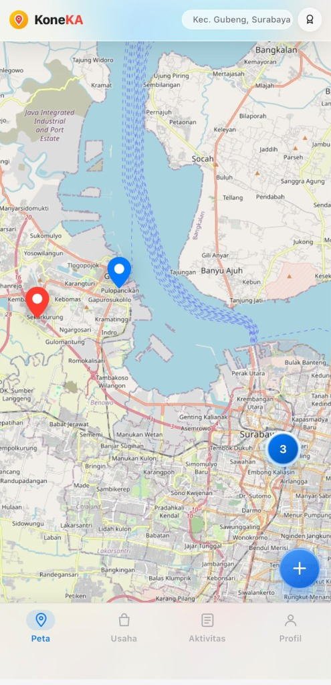
        <p style="font-size:12px;margin-top:6px"><b>Peta Interaktif Mobile</b><br/><em>Navigasi jempol &amp; floating action button</em></p>
      </td>
      <td width="25%" align="center" style="border:none;padding:8px">
        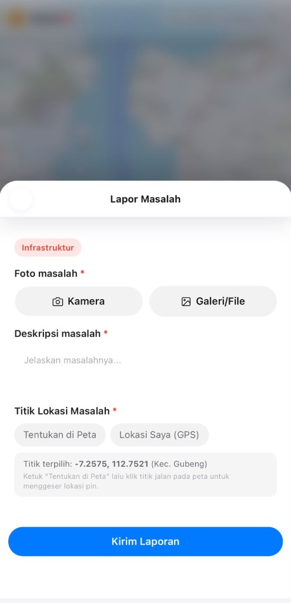
        <p style="font-size:12px;margin-top:6px"><b>Bottom Sheet Lapor</b><br/><em>Kamera &amp; GPS ponsel terintegrasi</em></p>
      </td>
      <td width="25%" align="center" style="border:none;padding:8px">
        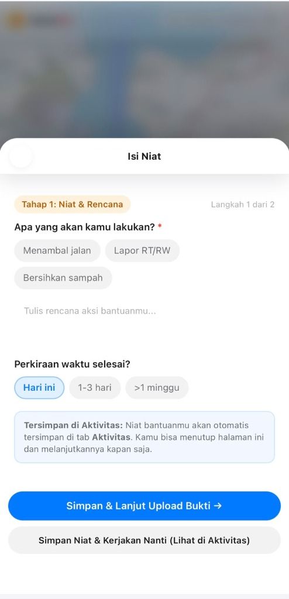
        <p style="font-size:12px;margin-top:6px"><b>Alur Gotong Royong</b><br/><em>Form respon warga di layar ponsel</em></p>
      </td>
      <td width="25%" align="center" style="border:none;padding:8px">
        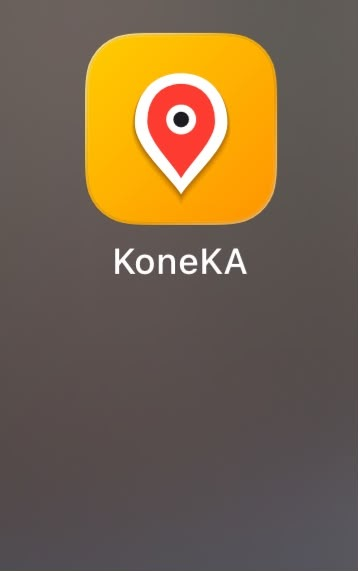
        <p style="font-size:12px;margin-top:6px"><b>Terpasang di Home Screen</b><br/><em>Ikon aplikasi resmi terinstal di HP</em></p>
      </td>
    </tr>
  </table>
</div>

---

### 📥 Panduan Mengunduh / Memasang Aplikasi di Smartphone

#### 🤖 Pengguna Android (Google Chrome, Microsoft Edge, Samsung Internet)
1. Buka peramban di ponsel Anda dan kunjungi **`https://koneka.netlify.app`**.
2. Klik menu titik tiga (**⋮**) di pojok kanan atas peramban (atau tunggu spanduk otomatis *"Tambahkan KoneKA ke Layar Utama"* muncul di bagian bawah).
3. Pilih menu **"Install Aplikasi"** atau **"Tambahkan ke Layar Utama" (Add to Home Screen)**.
4. Konfirmasi dengan menekan tombol **"Install"**.
5. Ikon aplikasi **KoneKA** akan langsung muncul di beranda dan laci aplikasi ponsel Anda, siap dibuka sewaktu-waktu layaknya aplikasi Android bawaan.

#### 🍏 Pengguna iPhone / iPad (Safari)
1. Buka peramban **Safari** dan akses **`https://koneka.netlify.app`**.
2. Tekan tombol **Share** (ikon kotak dengan panah ke atas) pada bilah navigasi Safari.
3. Gulir ke bawah lalu pilih menu **"Add to Home Screen"** (Tambahkan ke Layar Utama).
4. Beri nama (default: *KoneKA*), lalu ketuk **"Add"** di sudut kanan atas.
5. Aplikasi KoneKA kini telah terinstal di layar beranda iOS Anda dalam mode *Full-Screen Standalone*.

## 🛠️ Teknologi

### Tech Stack

#### Frontend
```
Bahasa       : HTML5 + Vanilla JavaScript (ES6+) + CSS3
Peta         : Leaflet.js v1.9.4 + Leaflet.MarkerCluster v1.5.3
State Mgmt   : Custom state object (SPA tanpa framework)
Ikon         : Custom inline SVG icon system
PWA          : Service Worker + Web App Manifest
```

#### Backend & Database
```
BaaS         : Firebase v11.0.1 (Compat SDK)
  - Auth     : Firebase Authentication (Email/Password)
  - Database : Cloud Firestore (NoSQL, real-time listeners)
  - Storage  : Firebase Cloud Storage (foto laporan, usaha, profil)
  - Analytics: Firebase Analytics
Serverless   : Netlify Functions (Node.js)
Email        : EmailJS + Resend API (pengiriman OTP)
Bot Protect  : Cloudflare Turnstile (server-side verification)
```

#### DevOps & Deployment
```
Hosting      : Netlify (primary) + Firebase Hosting (secondary)
Dev Server   : Node.js HTTP server (tanpa dependency — core modules only)
Security     : Content Security Policy, X-Frame-Options, X-XSS-Protection
Offline      : Service Worker (Cache-first + Network-first strategy)
```

### Alasan Pemilihan Teknologi

| Teknologi | Alasan Pemilihan |
|-----------|------------------|
| **Vanilla JS (tanpa framework)** | Meminimalkan ukuran bundle dan dependency seluruh logika SPA (state, render, event) dibangun dari nol, menghasilkan website yang sangat ringan dan cepat tanpa overhead framework |
| **Firebase (Auth + Firestore + Storage)** | Menyediakan real-time database, autentikasi, dan penyimpanan file dalam satu ekosistem terintegrasi, ideal untuk MVP yang membutuhkan kolaborasi real-time antar warga tanpa harus membangun backend dari nol |
| **Leaflet.js + MarkerCluster** | Library peta open-source yang ringan (~42KB gzipped) dengan ekosistem plugin yang kaya, MarkerCluster menangani performa marker yang banyak secara efisien |
| **Netlify Functions** | Serverless functions untuk logika backend yang sensitif (verifikasi Turnstile, pengiriman email) tanpa perlu mengelola server, gratis untuk tier development |
| **Cloudflare Turnstile** | Alternatif CAPTCHA modern yang ramah pengguna (invisible/managed challenge) melindungi form registrasi dari bot tanpa menggangu UX |
| **PWA (Service Worker)** | Memungkinkan instalasi di perangkat mobile layaknya aplikasi native, sekaligus menyediakan caching offline untuk akses tanpa internet |

### Dependencie

Zero npm dependencies.

| Library | Versi | Sumber |
|---------|-------|--------|
| Firebase SDK (Compat) | `11.0.1` | CDN `gstatic.com` |
| Leaflet.js | `1.9.4` | CDN `unpkg.com` |
| Leaflet.MarkerCluster | `1.5.3` | CDN `unpkg.com` |
| Cloudflare Turnstile | `v0` | CDN `challenges.cloudflare.com` |

---

## 🏗️ Arsitektur Sistem

### System Architecture

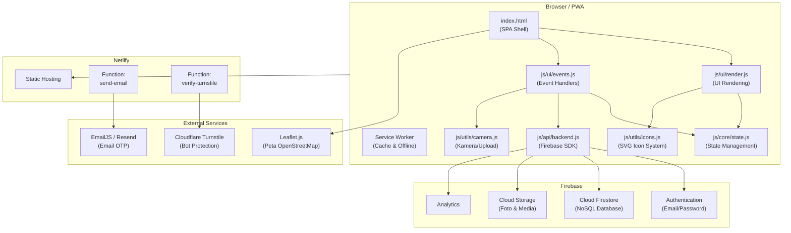

### Database Schema (Cloud Firestore)

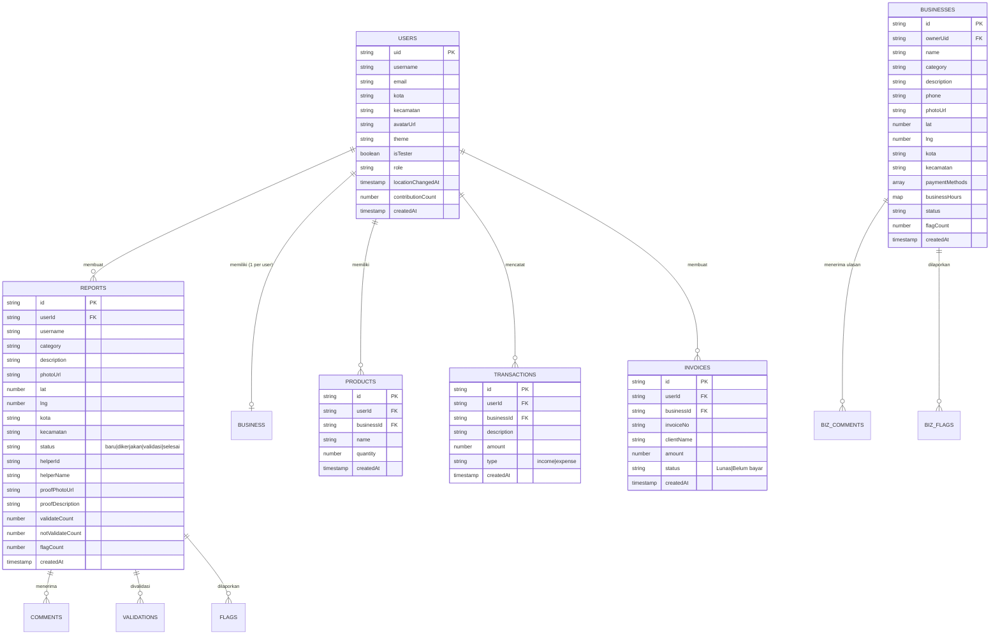

### Folder Structure

```
Koneka-Web/
├── index.html                   # Single Page Application (SPA) shell & root entry point
├── build.js                     # Skrip otomatisasi build & validasi integritas aset, sintaksis JS, JSON, PWA & Netlify
├── server.js                    # Local development server (Node.js core HTTP, zero external dependency)
├── package.json                 # Metadata proyek, dependensi development, & skrip npm (start, build, test)
├── package-lock.json            # Lockfile dependensi npm
├── manifest.json                # Web App Manifest untuk dukungan instalasi Progressive Web App (PWA)
├── sw.js                        # Service Worker untuk caching aset & kemampuan akses luring (offline support)
├── firebase.json                # Konfigurasi deployment Firebase Hosting, Firestore, dan Storage
├── .firebaserc                  # Alias dan project ID Firebase (koneka-web)
├── firestore.rules              # Aturan keamanan database Cloud Firestore (RBAC & moderasi super-admin)
├── storage.rules                # Aturan keamanan penyimpanan berkas Firebase Cloud Storage
├── netlify.toml                 # Konfigurasi deployment Netlify (redirects SPA, security headers, build command)
├── _redirects                   # Netlify rewrite rules untuk SPA routing (/* -> /index.html 200)
├── .env                         # Environment variables (Turnstile sitekey/secret, admin email, API keys)
├── icon.svg                     # Vektor logo resmi aplikasi KoneKA
├── icon-192.png                 # Ikon PWA beresolusi 192x192 px
├── icon-512.png                 # Ikon PWA beresolusi 512x512 px
├── screenshot_1.png             # Dokumentasi visual desktop: Peta Interaktif & Marker Masalah/UMKM
├── screenshot_2.png             # Dokumentasi visual desktop: Formulir Pelaporan Masalah & Kamera
├── screenshot_3.png             # Dokumentasi visual desktop: Dashboard Manajemen Finansial UMKM
├── screenshot_4.png             # Dokumentasi visual desktop: Alur Gotong Royong Peer-to-Peer Resolution
├── screenshot_5.png             # Dokumentasi visual desktop: Detail Informasi & Ulasan Profil UMKM
├── mobile_screenshot_1.jpg      # Dokumentasi visual mobile: Peta Interaktif & Bottom Navigation Bar
├── mobile_screenshot_2.jpg      # Dokumentasi visual mobile: Formulir Lapor Masalah via Bottom Sheet
├── mobile_screenshot_3.jpg      # Dokumentasi visual mobile: Alur Gotong Royong Niat & Rencana
├── mobile_pwa_installed.jpg     # Dokumentasi visual PWA: Aplikasi KoneKA Terpasang di Home Screen HP
├── css/
│   └── styles.css               # Seluruh tata gaya antarmuka, tema terang/gelap, animasi, & layout responsif (~31KB)
├── js/
│   ├── core/
│   │   └── state.js             # Reactive centralized state management, basis data wilayah Indonesia, & auth helpers
│   ├── api/
│   │   └── backend.js           # Firebase SDK client, auth state, Firestore CRUD, listeners real-time, & Leaflet clustering
│   ├── ui/
│   │   ├── render.js            # Fungsi rendering modular seluruh layar SPA, sheet modal, & panel admin
│   │   └── events.js            # Sentralisasi event handling (event delegation), aksi tombol, form dispatch & toast
│   └── utils/
│       ├── camera.js            # Integrasi kamera gawai (facing environment/user) & kompresi foto base64
│       └── icons.js             # Sistem ikon inline SVG berkinerja tinggi tanpa dependensi eksternal
└── netlify/
    └── functions/
        ├── send-email.js        # Serverless: pengiriman email kode OTP verifikasi registrasi (EmailJS / Resend)
        └── verify-turnstile.js  # Serverless: verifikasi token Cloudflare Turnstile anti-bot sisi server (siteverify)
```

---

## 🔒 Sistem Keamanan & Proteksi Siber

KoneKA dirancang dengan menerapkan prinsip **Defense-in-Depth** dan **Zero Trust**, memastikan data warga, pelaku UMKM, dan platform terlindungi dari serangan siber umum maupun manipulasi data komunitas.

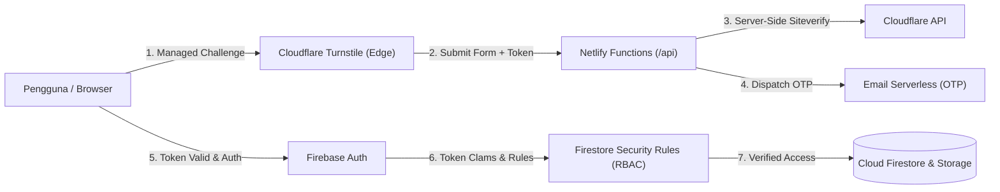

### 1. Cloudflare Turnstile Anti-Bot Protection (Edge & Server-Side Siteverify)
- **Tantangan Cerdas Ramah Privasi**: KoneKA menggunakan Cloudflare Turnstile pada antarmuka registrasi dan pembukaan situs untuk menangkal bot otomatis, spammer, dan serangan *credential stuffing* tanpa mengganggu kenyamanan warga dengan teka-teki visual usang.
- **Verifikasi Kanonikal Sisi Server (Server-Side Verification)**: Token verifikasi dari widget klien tidak langsung dipercaya begitu saja di browser. Aplikasi mengirimkan token ke endpoint serverless `POST /api/verify-turnstile` (`netlify/functions/verify-turnstile.js`), yang kemudian secara kriptografis memverifikasikannya ke API resmi Cloudflare (`https://challenges.cloudflare.com/turnstile/v0/siteverify`) menggunakan kunci rahasia (`TURNSTILE_SECRET`) yang terisolasi di server.

### 2. Autentikasi Dua Langkah Berbasis Email OTP (Two-Factor Registration)
- **Validasi Keaslian Warga**: Setiap pembuatan akun baru diwajibkan melakukan konfirmasi alamat email menggunakan kode OTP 5-karakter alfanumerik acak.
- **Window Kedaluwarsa & Rate Limiting**: Kode OTP otomatis kedaluwarsa dalam 5 menit. Tombol kirim ulang dilengkapi *cooldown* 60 detik untuk mencegah eksploitasi pengiriman email masal (*email bombing*).
- **Arsitektur Pengiriman Terisolasi**: Pengiriman dilakukan via Netlify Function (`send-email.js`) yang mengintegrasikan EmailJS dan failover Resend API, sehingga kredensial API pengiriman email tidak pernah bocor ke sisi klien.

### 3. Role-Based Access Control (RBAC) & Database Security Rules
Aturan keamanan pada `firestore.rules` dan `storage.rules` menegakkan batasan akses secara mutlak di tingkat basis data:
- **Profil Pengguna (`/users/{uid}`)**: Warga hanya dapat membaca dan menulis dokumen profil milik mereka sendiri (`request.auth.uid == userId`).
- **Laporan Masalah (`/reports/{id}`)**: Warga terotentikasi dapat membuat laporan, warga yang berniat membantu (*helper*) dapat mengunggah bukti penyelesaian, dan validasi suara dibatasi maksimal 1 suara per akun warga.
- **Direktori UMKM (`/businesses/{id}`)**: Informasi usaha hanya dapat dimodifikasi oleh pemilik usaha yang sah (`request.auth.uid == resource.data.ownerUid`).
- **Otoritas Khusus Super-Admin**: Akses moderasi eksekutif diproteksi secara khusus pada aturan keamanan:
  ```javascript
  function isAdmin() {
    return request.auth != null && (
      request.auth.token.email == 'Koqw2wq10xnH9wbalao81alqm@gmail.com' ||
      request.auth.token.admin == true
    );
  }
  ```

### 4. Sistem Moderasi Berjenjang Komunitas (Multi-Tier Flagging)
- **Laporan Masalah Warga**: Laporan yang ditandai (*flag*) oleh $\ge 3$ warga secara otomatis disembunyikan/dihapus dari peta publik demi menjaga ketertiban ruang bersama.
- **Direktori UMKM (Threshold 5 Laporan & Panel Moderasi Admin)**: Untuk mencegah persaingan tidak sehat antar-pedagang, usaha yang dilaporkan $\ge 5$ kali **tidak langsung dihapus sepihak**. Usaha dialihkan ke status `pending_admin` (`needsAdminReview: true`) dan dimunculkan di **Panel Moderasi Tab Aktivitas** khusus akun admin untuk ditinjau secara saksama (**Setujui** jika aman atau **Tolak/Hapus** jika terbukti melanggar).

### 5. Sanitasi Data & Proteksi Injeksi XSS
- **Pembersihan Karakter Berbahaya**: Seluruh input teks dari warga (komentar diskusi, deskripsi masalah, ulasan UMKM, dan alasan pelaporan) disanitasi sebelum dimasukkan ke dalam DOM menggunakan konversi entitas HTML (`.replace(/</g, '&lt;')`).
- **HTTP Security Headers**: Berkas `netlify.toml` mengonfigurasi header proteksi peramban:
  - `X-Frame-Options: DENY` (mencegah serangan *clickjacking*).
  - `X-Content-Type-Options: nosniff` (mencegah *MIME-sniffing exploit*).
  - `X-XSS-Protection: 1; mode=block` (mengaktifkan filter XSS bawaan peramban).
  - `Referrer-Policy: strict-origin-when-cross-origin`.

### 6. Mekanisme Anti-Manipulasi Wilayah
- Perubahan domisili akun (Kota & Kecamatan) dibatasi dengan **cooldown 30 hari** (`locationChangedAt`) untuk mencegah manipulasi reputasi kontribusi gotong royong dan peringkat *Leaderboard* antarwilayah.

---

## ⚙️ Instalasi & Setup

### Prerequisites

Pastikan Anda telah menginstall:
- **Node.js** (v18.x atau lebih tinggi) 
- **Git** # untuk clone repository
- **Browser modern** (Chrome, Edge, Firefox, Safari)

### Langkah Instalasi

#### 1️⃣ Clone Repository

```bash
git clone https://github.com/segoiwakpeyek/KoneKa-.git
cd KoneKa-
```

#### 2️⃣ Setup Environment Variables

Buat file `.env` di root directory (opsional, untuk Netlify Functions lokal):

```env
# Cloudflare Turnstile
TURNSTILE_SITEKEY="your_turnstile_site_key"
TURNSTILE_SECRET="your_turnstile_secret_key"
TURNSTILE_HOSTNAMES="localhost,127.0.0.1,koneka.netlify.app"

# EmailJS (opsional, untuk pengiriman email OTP)
EMAILJS_SERVICE_ID="your_emailjs_service_id"
EMAILJS_TEMPLATE_ID="your_emailjs_template_id"
EMAILJS_PUBLIC_KEY="your_emailjs_public_key"

# Resend (opsional, fallback email provider)
RESEND_API_KEY="your_resend_api_key"
```

#### 3️⃣ Run Development Server

```bash
npm start
```

atau langsung:

```bash
node server.js
```

Aplikasi akan berjalan di `http://localhost:3000` 

#### Alternatif: Tanpa Server

Karena `index.html` adalah file statis, Anda juga bisa:
- **VS Code Live Server** — klik kanan pada `index.html` → "Open with Live Server"
- **Double-click** — buka `index.html` langsung di browser

#### 4️⃣ Akun Testing

Untuk menguji semua fitur tanpa registrasi lengkap:

```
Email    :  Koqw2wq10xnH9wbalao81alqm@gmail.com
Password : BFC/Yp64}2sJQ]Y9(t?D;^LO%15.]kWh57;0c^.Sc/%aIpc<-G&QFV7:?E8-Hyq]lCXP6b9e6t+cR-B/:>VB0dX;P+jQwZTu7HohiIi]t^6lv1};UF#Oe.@l%Z>;xh%>VuvS!NL6.9TP(H>]b(V8om4J{lCk4HZL%#L2#zKGtsMp3HhrnQep6i9=wHIGTa!e[q1Qk2chw&{%%q-sun.&>l5Q2q0GOx81=P;{OHOaa^EO+ayB9gEYy7P1r6Wa?h]j
```
---

## 🚀 Penggunaan

### Menjalankan Aplikasi

```bash
# Menjalankan server development
npm start

# Deploy ke Firebase Hosting
firebase deploy

# Deploy ke Netlify (via Git push atau CLI)
netlify deploy --prod
```

### User Guide

#### Untuk Warga (Pengguna Umum)

1. **Registrasi**:Buka aplikasi lalu klik "Daftar" kemudian isi nama pengguna, email, password, pilih kota & kecamatan setelah itu, verifikasi email dengan kode OTP dan akun siap digunakan.
2. **Lapor Masalah**: Dari tab Peta, tekan tombol "Lapor" kemudian pilih kategori masalah, lalu ambil foto (kamera/galeri), tulis deskripsi, tentukan titik lokasi di peta dan kirim laporan.
3. **Bantu Selesaikan**: Klik pin merah di peta lalu lihat detail masalah, tekan "Saya Mau Bantu" kemudian pilih niat & estimasi waktu, setelah selesai, unggah bukti foto + deskripsi.
4. **Validasi Bukti**: Klik pin kuning di peta, lihat bukti penyelesaian, tekan "Valid" atau "Tidak Valid". Jika 3 warga setuju valid, masalah ditandai selesai.
5. **Diskusi**: Klik pin mana saja, scroll ke bagian komentar dan tulis komentar atau gunakan quick-chip
6. **Lihat Aktivitas**: Buka tab Aktivitas, lihat riwayat laporan Anda dan kontribusi membantu.

#### Untuk Pelaku UMKM

1. **Daftarkan Usaha**: Buka tab Usaha lalu tekan "Daftarkan Usaha" kemudian isi nama, kategori, deskripsi, nomor telepon, unggah foto, tentukan lokasi di peta, pilih metode pembayaran lalu kirim.
2. **Dashboard Usaha**: Setelah mendaftar, akses fitur:
   - 📦 **Stok**: Tambah produk baru (nama + jumlah), edit stok, hapus produk. Indikator warna otomatis (merah <5, kuning <15, hijau ≥15)
   - 💰 **Cashflow**: Catat pemasukan/pengeluaran harian, lihat grafik periode harian/mingguan/bulanan.
   - 🧾 **Invoice**: Buat invoice otomatis (nomor urut auto-increment), isi nama klien + nominal + status pembayaran.
3. **Pengaturan Usaha**: Atur jam operasional per hari (Senin–Minggu), aktifkan "Tutup Sementara" untuk libur, dan kelola metode pembayaran. 

#### Untuk Admin Tester

1. **Login**: Masuk menggunakan kredensial resmi super-admin:
   - **Email**: `Koqw2wq10xnH9wbalao81alqm@gmail.com`
   - **Password**: `BFC/Yp64}2sJQ]Y9(t?D;^LO%15.]kWh57;0c^.Sc/%aIpc<-G&QFV7:?E8-Hyq]lCXP6b9e6t+cR-B/:>VB0dX;P+jQwZTu7HohiIi]t^6lv1};UF#Oe.@l%Z>;xh%>VuvS!NL6.9TP(H>]b(V8om4J{lCk4HZL%#L2#zKGtsMp3HhrnQep6i9=wHIGTa!e[q1Qk2chw&{%%q-sun.&>l5Q2q0GOx81=P;{OHOaa^EO+ayB9gEYy7P1r6Wa?h]j`
2. **Panel Moderasi Usaha (Tab Aktivitas)**: Khusus akun admin, Tab Aktivitas menampilkan kartu moderasi bagi UMKM yang menerima $\ge 5$ laporan warga. Admin dapat memilih aksi:
   - **Setujui**: Mengembalikan usaha ke status aktif dan mereset laporan menjadi 0.
   - **Tolak**: Menghapus usaha dari direktori publik dan peta secara permanen.
   - **Peta**: Berpindah ke peta dan memfokuskan tampilan langsung pada koordinat lokasi usaha terkait.
   - **Detail**: Membuka lembar profil UMKM lengkap beserta riwayat ulasan warga.
3. **Validasi Tanpa Batas**: Akun admin dapat memberikan validasi pada laporan masalah berkali-kali tanpa dibatasi aturan *1-vote-per-user*, berguna untuk pengujian siklus hidup laporan hingga selesai.
4. **Pelaporan / Flagging Tanpa Batas**: Admin dapat melakukan pelaporan konten berkali-kali untuk menguji mekanisme *auto-delete* (ambang 3 laporan) dan eskalasi moderasi UMKM (ambang 5 laporan).
5. **Akses Kontrol Langsung di Peta**: Admin dapat mengklik marker biru UMKM apa pun di peta untuk meninjau toko atau menghapus usaha langsung jika ditemukan pelanggaran darurat.

---

## 🔑 Penjelasan Kredensial Admin Tester

> [!NOTE]  
> **Pertanyaan Umum**: *Kenapa akun tester admin memiliki alamat email yang panjang/acak dan password yang mencapai 256 karakter?*

Akun tester admin sengaja **tidak menggunakan kredensial generik** seperti `admin@gmail.com` dengan sandi `123456` atau `admin123`. Pemilihan format email dan password berentropi tinggi ini didasari oleh standar keamanan rekayasa perangkat lunak profesional dan mitigasi ancaman siber:

### 1. Perlindungan Terhadap Hak Istimewa Super-Admin (Super-Privilege Protection)
Akun `Koqw2wq10xnH9wbalao81alqm@gmail.com` memiliki kekuasaan eksekutif tertinggi (*Super-Admin Privileges*) di platform KoneKA:
- Memiliki izin *bypass* pembatasan validasi dan pelaporan.
- Memiliki otoritas menghapus akun dan bisnis UMKM warga secara permanen.
- Menyetujui atau menolak konten yang dilaporkan masyarakat.

Jika akun dengan hak akses setinggi ini menggunakan kata sandi sederhana, maka sekali platform dideploy ke internet publik (seperti Netlify), akun admin akan langsung rentan diambil alih oleh peretas atau bot pemindai celah keamanan.

### 2. Kebal Serangan Kamus & Brute-Force Otomatis (Anti-Dictionary & Rainbow Table Attacks)
Bot penyerang secara otomatis dan tanpa henti melakukan pemindaian terhadap ribuan website di internet dengan metode *Dictionary Attack* dan *Credential Stuffing* (mencoba jutaan kata sandi bocor dari basis data seperti *RockYou*, *SecLists*, dan *HaveIBeenPwned*).  
Dengan menggunakan kata sandi kompleks sepanjang 256 karakter, kemungkinan kata sandi tersebut terdapat dalam basis data kamus penyerang adalah **0%**.

### 3. Entropi Kriptografi Maksimal (>1.500 Bits of Entropy)
Password akun admin dibangun menggunakan 256 karakter pseudo-random yang menggabungkan:
- Huruf besar (`A-Z`)
- Huruf kecil (`a-z`)
- Angka (`0-9`)
- Karakter simbol khusus ASCII (`!@#$%^&*()_+-=[]{}|;:,.<>?/`)

Tingkat entropi dari kata sandi ini adalah:
$$\text{Entropy} \approx 256 \times \log_2(94) \approx 1.678 \text{ bits}$$
Bahkan dengan superkomputer tercanggih di dunia yang mampu memproses $10^{18}$ tebakan per detik (1 Exaflop), dibutuhkan waktu **lebih dari triliunan tahun** untuk memecahkan kombinasi ini secara *brute force*.

### 4. Prinsip Anti-Enumerasi Akun (Security through Obscurity + Zero-Trust)
Email seperti `admin@koneka.id` atau `admin@gmail.com` sangat mudah ditebak melalui teknik *Account Enumeration*. Penggunaan alamat unik `Koqw2wq10xnH9wbalao81alqm@gmail.com` memastikan pihak luar tidak dapat menebak identitas pengelola sistem hanya dari nama domain.

### 5. Kenyamanan Pengujian Tetap Terjamin (Ready to Copy-Paste)
Meskipun memenuhi standar keamanan *Enterprise-Grade*, kredensial ini sengaja didokumentasikan secara terbuka di berkas `README.md` ini khusus untuk keperluan penilaian kompetisi **ITECHNO CUP 2026**.  
Dewan juri dan penguji dapat **langsung menyalin (*copy-paste*)** email dan password tersebut ke formulir login tanpa perlu melalui proses pendaftaran ulang ataupun verifikasi OTP email.

---

## 📚 API Documentation

### Arsitektur API

KoneKA menggunakan **dua jenis API**:
1. **Firebase Client SDK**: operasi database, auth, dan storage langsung dari browser via Firestore SDK
2. **Netlify Serverless Functions**: logika server-side yang sensitif (verifikasi bot, pengiriman email)

### Netlify Serverless Functions

#### Base URL

```
Development : http://localhost:3000/api
Production  : https://koneka.netlify.app/.netlify/functions
```

#### `POST /api/verify-turnstile`

Verifikasi token Cloudflare Turnstile di sisi server.

```javascript
// Request
const res = await fetch('/api/verify-turnstile', {
  method: 'POST',
  headers: { 'Content-Type': 'application/json' },
  body: JSON.stringify({ token: '<turnstile-token>' })
});

// Response (200 OK)
{ "success": true, "hostname": "koneka.netlify.app" }

// Response (403 Forbidden)
{ "success": false, "errors": ["invalid-input-response"] }
```

#### `POST /api/send-email`

Kirim email verifikasi OTP ke pengguna baru.

```javascript
// Request
const res = await fetch('/api/send-email', {
  method: 'POST',
  headers: { 'Content-Type': 'application/json' },
  body: JSON.stringify({
    to: 'user@example.com',
    name: 'Nama Pengguna',
    code: 'A1B2C',
    subject: 'Kode Verifikasi Akun KoneKA: A1B2C',
    html: '<html>...</html>',
    text: 'Kode verifikasi Anda: A1B2C'
  })
});

// Response (200 OK)
{ "success": true }
```

### Firebase Client SDK Functions

#### Authentication

| Fungsi | Deskripsi |
|--------|----------|
| `fbRegister(email, password, username, kota, kecamatan)` | Registrasi akun baru + buat dokumen profil di Firestore |
| `fbLogin(email, password)` | Login dengan email/password |
| `fbLogout()` | Logout dari sesi aktif |
| `fbDeleteAccount()` | Hapus akun beserta seluruh data terkait |

#### User Profile

| Fungsi | Deskripsi |
|--------|----------|
| `fbLoadUser(uid)` | Muat profil pengguna dari Firestore |
| `fbUpdateUser(uid, data)` | Update data profil (avatar, tema, dll.) |
| `fbChangeLocation(uid, kota, kecamatan)` | Ubah lokasi akun (cooldown 30 hari) |

#### Reports (Laporan Masalah)

| Fungsi | Deskripsi |
|--------|----------|
| `fbCreateReport(data, photoDataUrl)` | Buat laporan baru dengan foto |
| `fbListenReports(callback)` | Real-time listener untuk semua laporan |
| `fbGetReport(id)` | Ambil detail satu laporan |
| `fbHelpStep1(reportId, intent, timeframe, rencana)` | Claim bantuan (Step 1: deklarasi niat) |
| `fbHelpStep2(reportId, proofPhotoDataUrl, description)` | Submit bukti selesai (Step 2) |
| `fbValidate(reportId, isValid)` | Validasi bukti penyelesaian (true/false) |
| `fbFlagReport(reportId, reason)` | Laporkan konten bermasalah |
| `fbAddComment(reportId, text)` | Tambah komentar pada laporan |
| `fbLoadComments(reportId)` | Muat daftar komentar laporan |

#### Business (UMKM)

| Fungsi | Deskripsi |
|--------|----------|
| `fbRegisterBusiness(data, photoDataUrl)` | Daftarkan usaha baru |
| `fbLoadBusiness(uid)` | Muat data usaha milik user |
| `fbUpdateBusiness(uid, bizId, data)` | Update informasi usaha |
| `fbListenBusinesses(callback)` | Real-time listener direktori UMKM publik |
| `fbFlagBusiness(bizId, reason)` | Laporkan usaha bermasalah |
| `fbAddBizComment(bizId, text)` | Tambah ulasan pada usaha |
| `fbLoadBizComments(bizId)` | Muat daftar ulasan usaha |

#### Products, Transactions, Invoices

| Fungsi | Deskripsi |
|--------|----------|
| `fbAddProduct(bizId, name, quantity)` | Tambah produk baru |
| `fbLoadProducts(uid)` | Muat daftar produk |
| `fbDeleteProduct(id)` | Hapus produk |
| `fbUpdateProductQty(id, qty)` | Update jumlah stok |
| `fbAddTransaction(bizId, data)` | Catat transaksi cashflow |
| `fbLoadTransactions(uid)` | Muat riwayat transaksi |
| `fbCreateInvoice(bizId, data)` | Buat invoice (auto-numbering) |
| `fbLoadInvoices(uid)` | Muat daftar invoice |
| `fbDeleteInvoice(id)` | Hapus invoice |

#### Leaderboard & Activities

| Fungsi | Deskripsi |
|--------|----------|
| `fbLoadLeaderboard(kecamatan)` | Muat peringkat kontributor per kecamatan |
| `fbLoadMyReports(uid)` | Muat laporan milik user |
| `fbLoadMyHelps(uid)` | Muat riwayat bantuan user |

---

## 🧪 Testing & Verifikasi Otomatis

### Metode Pengujian

Proyek ini menggabungkan **pengujian otomatis (automated verification)** melalui skrip build integritas dan **pengujian fungsional berbasis skenario (manual scenario testing)**, didukung oleh **akun tester super-admin bawaan** (`Koqw2wq10xnH9wbalao81alqm@gmail.com`) untuk menguji seluruh siklus interaksi tanpa hambatan kuota.

### 🤖 Verifikasi Build Otomatis (`build.js`)

KoneKA dilengkapi dengan skrip verifikasi otomatis yang memvalidasi seluruh berkas sebelum proses deployment:

```bash
# Menjalankan build & validasi integritas kode
npm run build

# atau via script test
npm test
```

Pipeline verifikasi mencakup 4 tahap:
1. **Pemeriksaan Skema JSON**: Memvalidasi integritas sintaks `manifest.json`, `package.json`, dan `firebase.json`.
2. **Audit Sintaksis JavaScript**: Melakukan kompilasi AST pada seluruh modul frontend (`js/core/state.js`, `js/api/backend.js`, `js/ui/render.js`, `js/ui/events.js`, `js/utils/camera.js`, `js/utils/icons.js`), Service Worker (`sw.js`), Server lokal (`server.js`), serta Serverless Functions (`send-email.js`, `verify-turnstile.js`).
3. **Verifikasi Aset Statis & PWA**: Memastikan ketersediaan ikon vektor SVG, ikon PWA 192px & 512px, lembar gaya CSS, berkas konfigurasi rules, dan Netlify redirects.
4. **Kesiapan Serverless Functions**: Menguji ekspor fungsionalitas `send-email` dan `verify-turnstile`.

---

### Akun Tester Super-Admin

```
Email    : Koqw2wq10xnH9wbalao81alqm@gmail.com
Password : BFC/Yp64}2sJQ]Y9(t?D;^LO%15.]kWh57;0c^.Sc/%aIpc<-G&QFV7:?E8-Hyq]lCXP6b9e6t+cR-B/:>VB0dX;P+jQwZTu7HohiIi]t^6lv1};UF#Oe.@l%Z>;xh%>VuvS!NL6.9TP(H>]b(V8om4J{lCk4HZL%#L2#zKGtsMp3HhrnQep6i9=wHIGTa!e[q1Qk2chw&{%%q-sun.&>l5Q2q0GOx81=P;{OHOaa^EO+ayB9gEYy7P1r6Wa?h]j
Role     : super_admin
```

Hak istimewa akun tester:
- **Validasi Tanpa Batas**: Dapat memvalidasi satu laporan berkali-kali tanpa dibatasi aturan *1-vote-per-user*.
- **Flagging Tanpa Batas**: Dapat melaporkan konten berkali-kali untuk menguji mekanisme *auto-delete* dan moderasi.
- **Panel Moderasi Usaha**: Membuka kartu moderasi khusus di Tab Aktivitas untuk menyetujui atau menolak UMKM yang dilaporkan $\ge 5$ warga.
- **Inspeksi & Aksi Peta**: Dapat mengklik dan mengelola seluruh marker UMKM (biru) di peta.

### Skenario Uji

| No | Skenario | Langkah Pengujian | Hasil yang Diharapkan |
|----|----------|-------------------|-----------------------|
| 1 | **Registrasi Akun** | Buka app → Daftar → Isi form → Verifikasi OTP | Akun berhasil dibuat, redirect ke peta |
| 2 | **Login & Logout** | Masuk dengan email/password → Logout | State direset, kembali ke splash screen |
| 3 | **Buat Laporan** | Login → Lapor → Isi form + foto + lokasi → Kirim | Pin merah muncul di peta secara real-time |
| 4 | **Bantu & Submit Bukti** | Klik pin merah → "Saya Mau Bantu" → Isi form → Upload bukti | Status berubah ke "Validasi" (pin kuning) |
| 5 | **Validasi 3x Valid** | Klik pin kuning → Validasi (3x dengan akun tester) | Status berubah ke "Selesai", pin hijau hilang otomatis setelah 5 detik |
| 6 | **Validasi 3x Tidak Valid** | Klik pin kuning → Validasi Tidak Valid (3x) | Status kembali ke "Baru", bukti pengerjaan dibatalkan |
| 7 | **Flag Laporan Warga** | Klik detail laporan → Flag → Pilih alasan (3x) | Laporan otomatis dihapus dari peta |
| 8 | **Daftar UMKM** | Tab Usaha → Daftarkan Usaha → Isi form → Kirim | Pin biru UMKM muncul di peta |
| 9 | **Moderasi UMKM (Admin)** | Tab Aktivitas (login admin) → Tinjau usaha terlapor $\ge 5$ → Tekan Setujui / Tolak / Peta | Usaha disetujui (aktif kembali) atau ditolak (dihapus permanen) |
| 10 | **Kelola Stok Produk** | Dashboard Usaha → Stok → Tambah produk | Produk muncul di daftar dengan indikator warna stok |
| 11 | **Buat Invoice Otomatis** | Dashboard Usaha → Invoice → Buat invoice | Invoice terbit dengan nomor urut auto-increment |
| 12 | **Catat Transaksi Kas** | Dashboard Usaha → Cashflow → Catat pemasukan/pengeluaran | Transaksi tercatat di riwayat & grafik terupdate |
| 13 | **Ganti Lokasi Domisili** | Profil → Pengaturan → Ganti Lokasi | Lokasi berubah, cooldown 30 hari aktif |
| 14 | **Diskusi & Komentar** | Detail laporan / UMKM → Tulis komentar / quick-chip | Komentar muncul di daftar diskusi |
| 15 | **Tema Gelap & Terang** | Profil → Pengaturan → Mode Gelap | Seluruh UI & peta beralih ke palet tema gelap |
| 16 | **PWA Installable** | Buka di Chrome Mobile / Desktop → Install prompt | Aplikasi terpasang di layar beranda gawai |

### Security Rules Testing

Firestore dan Storage security rules dapat diuji menggunakan Firebase Emulator Suite:

```bash
# Install Firebase CLI
npm install -g firebase-tools

# Jalankan emulator
firebase emulators:start

# Rules akan di-enforce secara lokal
# Test di: http://localhost:4000 (Emulator UI)
```

---

## 📄 Lisensi

Proyek ini dilisensikan di bawah [MIT License](LICENSE) - lihat file LICENSE untuk detail lebih lanjut.

---

<div align="center">

  **Made with ❤️ by SEGOIWAKPEYEK for ITECHNO CUP 2026**

  
</div>
